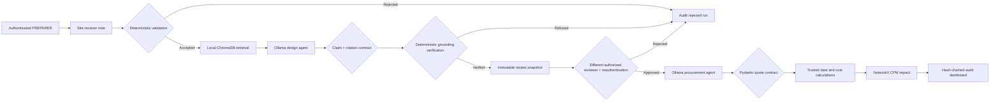

# Construction Multi-Agent System

A private, local proof-of-concept that turns a controlled construction revision note into a traceable design extraction, authenticated human review package, procurement planning estimate, and Critical Path Method (CPM) impact. The language-model agents run through Ollama; deterministic Python validation, Pydantic contracts, role-based authorization, and a hash-chained audit ledger prevent invalid or unauthorized actions from silently entering the workflow.

> This application supports planning demonstrations. It does not replace a licensed engineer, a verified supplier quotation, an approved project programme, or access to the full licensed standards.

## What the system does

1. Rejects irrelevant, ambiguous, contradictory, or incomplete notes before calling the LLM.
2. Routes each question to the relevant controlled discipline and retrieves top-k passages using semantic + BM25-style lexical ranking from persistent local ChromaDB.
3. Uses a local Ollama design agent to extract a validated revision and claim-level technical guidance.
4. Verifies that every technical claim cites a retrieved chunk and contains a verbatim supporting quote.
5. Requires a signed-in `PREPARER` account before creating an immutable SHA-256 review snapshot.
6. Requires a different authenticated `DESIGN_REVIEWER` or `PROJECT_MANAGER` account and fresh password verification before one decision.
7. Blocks procurement and scheduling when the package is pending, rejected, changed, replayed, self-reviewed, or unauthorized.
8. After approval, uses a local procurement agent to produce clearly labelled **unverified estimates**.
9. Recalculates arithmetic and delivery dates deterministically in Python.
10. Maps the affected element to the correct task in the demonstration CPM network.
11. Stores authentication, authorization, approval, rejection, completion, and failure events in an ordered SHA-256 audit chain.



## Requirements

- Windows, macOS, or Linux
- Python 3.12 (the tested version)
- Ollama running locally
- Approximately 6 GB available for the `llama3.1` model

Python 3.12 is supported; installing Python 3.11 is not required for this repository.

## Setup on Windows PowerShell

```powershell
cd "D:\Project Data\Trials\Final XAI\Passant\MultiAgents"
python -m venv .venv
.\.venv\Scripts\Activate.ps1
python -m pip install --upgrade pip
python -m pip install -r requirements.txt
Copy-Item .env.example .env
```

Create separate local accounts from the trusted workstation terminal. Passwords are
entered interactively and are never placed in the command, source code, or `.env` file:

```powershell
python manage_users.py create --username preparer --display-name "Package Preparer" --role PREPARER
python manage_users.py create --username reviewer --display-name "Design Reviewer" --role DESIGN_REVIEWER
python manage_users.py create --username admin --display-name "Local Administrator" --role ADMIN
python manage_users.py list
```

Passwords must contain 12-128 characters. They are stored using unique 16-byte salts and
Python's `scrypt` implementation with `N=2^15`, `r=8`, and `p=3`. Five failed attempts
lock an account for 15 minutes. Local shell and database access remain a trusted
workstation-administrator boundary.

Verify and ingest the controlled RAG source documents:

```powershell
python ingest_documents.py
```

The command verifies each PDF checksum and page count before creating
`rag_data/chunks.jsonl`. Every chunk contains its document edition, jurisdiction,
discipline, document status, source-check date, section or clause when detected, printed
and PDF page numbers, official source URL, licence, and source checksum. The controlled
corpus contains official England Approved Documents A (structure), C (ground/moisture),
K (falling/collision/impact), and 7 (materials/workmanship). `rag_data/` is generated
locally and is intentionally not committed.

Build the persistent vector index and run both labelled retrieval and grounding evaluations:

```powershell
python index_documents.py
python evaluate_rag.py
python evaluate_grounding.py
```

The first index build uses Chroma's local `all-MiniLM-L6-v2` ONNX embedding model
(384 dimensions) and may download approximately 80 MB into the user's model cache.
No hosted embedding API or API key is required. The index is stored under
`rag_data/chroma` and is reused across application restarts. Re-running
`index_documents.py` is idempotent when the controlled JSONL content has not changed.
The collection contract records both the embedding model identity and its artifact SHA-256;
an incompatible persisted collection is rejected rather than silently mixed.
Retrieval first routes explicit discipline terms to the strongest matching document set,
then combines 75% semantic similarity with 25% normalized lexical relevance. Queries with
no route receive a confidence penalty, while commercial and out-of-jurisdiction intent is
guarded explicitly. The current controlled build contains 586 auditable chunks, of which
526 are retrieval eligible.

Install and prepare Ollama:

```powershell
ollama pull llama3.1
ollama list
```

If the Ollama desktop service is not already running:

```powershell
ollama serve
```

## Run the dashboard

```powershell
python -m streamlit run app.py
```

Open `http://localhost:8501` and use a complete input such as:

```text
Site update Rev-102: Need 150 m3 of C60 concrete for the column pour.
```

Sign in as the `PREPARER`. The note must contain a revision ID, construction action,
supported material, affected element, positive quantity, and unit.

When a grounded package is created, it appears in **Human approval queue**. Inspect the
site note, material requirements, verified claims, cited passages, and snapshot SHA-256;
then sign out and sign in with a different `DESIGN_REVIEWER` or `PROJECT_MANAGER`
account. Re-enter that account's password and record **APPROVE** or **REJECT**.
Procurement planning and CPM analysis run only after approval. A rejection is terminal,
and the same review cannot be decided twice. Sessions expire after 30 idle minutes or
eight total hours.

Account maintenance remains an explicit local administrator action:

```powershell
python manage_users.py deactivate --username reviewer
python manage_users.py activate --username reviewer
python manage_users.py reset-password --username reviewer
```

## Run the automated tests

The tests do not call a real language model; Ollama responses are mocked where necessary.

```powershell
python -m unittest discover -s tests -v
python -m unittest test_stress_cases -v
```

Before a demonstration or release, run the complete local readiness contract:

```powershell
python release_check.py --database construction_mas.db --runtime --with-ollama
```

This verifies Python and exact dependency versions, controlled source checksums and page
counts, release files, ignore rules, SQLite integrity, foreign keys, the audit chain,
the persistent RAG index, and the configured Ollama model. See
[RELEASE_CHECKLIST.md](RELEASE_CHECKLIST.md) for the full release and recovery sequence.

The suite verifies input rejection, password hashing and lockout, session expiration,
server-side role permissions, approval-time reauthentication, separation of duties,
Pydantic contracts, multiple-material storage, foreign-key enforcement, trusted
procurement arithmetic and dates, CPM calculations, persistent ChromaDB retrieval,
controlled-PDF integrity, citation metadata, confidence rejection, approval/rejection
gating, snapshot tamper detection, replay prevention, database migration, and audit-chain
integrity.

## Configuration

Copy `.env.example` to `.env`.

| Variable | Default | Purpose |
|---|---|---|
| `CONSTRUCTION_DATABASE_PATH` | `construction_mas.db` | Runtime SQLite path |
| `CONSTRUCTION_OLLAMA_MODEL` | `llama3.1` | Installed Ollama model |
| `CONSTRUCTION_RAG_COLLECTION_NAME` | `construction-standards` | Local vector collection |
| `CONSTRUCTION_RAG_DOCUMENTS_PATH` | `rag_documents` | Controlled PDF sources and manifest |
| `CONSTRUCTION_RAG_DATA_PATH` | `rag_data` | Generated chunks, index, and evaluation reports |
| `CONSTRUCTION_RAG_CHUNKS_PATH` | `rag_data/chunks.jsonl` | Verified citation-ready ingestion output |
| `CONSTRUCTION_RAG_INDEX_PATH` | `rag_data/chroma` | Persistent local ChromaDB directory |
| `CONSTRUCTION_RAG_TOP_K` | `3` | Maximum cited passages supplied to the design agent |
| `CONSTRUCTION_RAG_MINIMUM_SIMILARITY` | `0.45` | Calibrated hybrid-score acceptance floor |
| `CONSTRUCTION_RAG_SEMANTIC_WEIGHT` | `0.75` | Semantic component of the hybrid retrieval score |
| `CONSTRUCTION_RAG_LEXICAL_WEIGHT` | `0.25` | BM25-style lexical component of the hybrid retrieval score |

## Main files

| File | Responsibility |
|---|---|
| `validation.py` | Rejects unsafe or incomplete inputs before the LLM |
| `schemas.py` | Pydantic contracts and numeric constraints |
| `rag_engine.py` | Discipline routing, hybrid retrieval, persistent ChromaDB, citations, and confidence rejection |
| `ingest_documents.py` | Verified PDF extraction and citation-ready chunk generation |
| `index_documents.py` | Idempotent local MiniLM embedding and persistent indexing |
| `evaluate_rag.py` | Labelled Hit@k, MRR, acceptance, and rejection evaluation |
| `design_agent.py` | Evidence-only design extraction through Ollama |
| `grounding.py` | Claim/chunk integrity, exact-quote alignment, numeric support, site-fact isolation, and version-conflict checks |
| `evaluate_grounding.py` | Real-document acceptance and guard-rejection evaluation |
| `approval.py` | Immutable review snapshots, SHA-256 integrity, stale-state checks, and replay prevention |
| `security.py` | Scrypt authentication, lockout, sessions, RBAC, reauthentication, and account controls |
| `audit.py` | Ordered SHA-256 event chain and integrity verification |
| `manage_users.py` | Interactive trusted-workstation account administration |
| `release_check.py` | Deterministic source, dependency, database, RAG, and Ollama readiness checks |
| `generate_acceptance_evidence.py` | Privacy-safe final acceptance evidence and Markdown/JSON report generator |
| `ACCEPTANCE_REPORT.md` | Human-readable evidence for the tested release baseline |
| `ACCEPTANCE_EVIDENCE.json` | Machine-readable acceptance evidence without credentials or project-note content |
| `manage_backup.py` | Verified SQLite online backup, validation, and guarded restore operations |
| `release_ops.py` | Atomic backup/recovery implementation and integrity manifests |
| `procurement_agent.py` | Unverified procurement estimates with trusted local calculations |
| `cpm_solver.py` | NetworkX schedule and critical-path calculations |
| `agent_pipeline.py` | Orchestration and run-status audit trail |
| `database.py` | SQLite schema, migrations, transactions, and queries |
| `app.py` | Streamlit control centre |

## Data and trust boundaries

- Procurement suppliers and prices are LLM planning estimates and are stored as `PENDING_VERIFICATION` / `LLM_ESTIMATE_UNVERIFIED`.
- Package creation requires an active `PREPARER`. Decisions require an active
  `DESIGN_REVIEWER` or `PROJECT_MANAGER`, fresh password verification, and a different
  authenticated user from the preparer.
- Procurement and schedule agents run only after a verified package receives one
  authorized approval. Rejection is terminal, and a changed or replayed package is blocked.
- Authentication is local to the workstation. It does not provide MFA, federation,
  account recovery, enterprise SSO, or a legally qualified electronic signature.
- The SHA-256 audit chain detects ordinary modification, deletion, insertion, and
  reordering relative to its stored head. It is not an externally anchored digital
  signature; a database administrator able to rewrite the entire chain and its head remains
  inside the trusted local-workstation boundary.
- Delivery dates and total costs are recalculated in Python instead of being trusted from the model.
- The live retriever uses controlled PDF chunks, a pretrained MiniLM embedding model running locally,
  BM25-style lexical evidence, discipline routing, persistent ChromaDB storage, top-k
  citations, and a calibrated hybrid confidence threshold.
- The current labelled set has 18 in-scope and 7 out-of-scope questions. The verified
  build reaches 100% Hit@5, Top-1 accuracy, MRR, routing accuracy, positive acceptance,
  and negative rejection on that set. Passing it
  demonstrates this controlled corpus and query set; it is not a general compliance benchmark.
- Technical guidance output is accepted only when every claim cites a retrieved immutable
  chunk, includes a verbatim source quote, passes lexical and numeric support checks, and
  uses current governance-compatible document versions. A bounded correction attempt repairs
  invalid model contracts; deterministic quote alignment can select an exact supporting sentence
  from the model-selected chunk, but only when claim tokens and numbers remain supported. Site-note
  verification separately prevents retrieved standards from creating procurement requirements.
  The grounding guard evaluation covers all four documents plus seven rejection mutations; it does not replace expert
  semantic review or prove that a language model can never produce a misleading claim.
- The included Approved Documents A, C, K and 7 apply to England and are not Egyptian
  compliance authority. Consult the controlled official publication and a licensed engineer
  for engineering decisions.
- The CPM model is a five-task demonstration schedule, not a live Primavera P6 or Microsoft Project integration.
- The workflow is sequentially orchestrated. The agents do not autonomously negotiate or approve construction decisions; the recorded human decision is an explicit gate.

## Deployment

See [DEPLOYMENT.md](DEPLOYMENT.md) for the local demonstration checklist, backup and
recovery procedure, LAN access, and production-readiness boundary. Security controls and
reporting guidance are documented in [SECURITY.md](SECURITY.md).

Generate a reproducible acceptance pack after creating a validated backup:

```powershell
python generate_acceptance_evidence.py --database construction_mas.db `
  --backup "backups\<backup-file>.db" --runtime --with-ollama
```

The generator runs the release checks, repository and stress tests, reads the controlled
retrieval/grounding evaluations, validates the backup, and writes aggregate evidence only.
It intentionally excludes usernames, passwords, site-note text, and procurement details.

## Repository policy

- Runtime `.db` files are intentionally not versioned because they may contain local project records.
- `.env` and Streamlit secrets are never committed.
- `GITHUB_ACTIONS_VALIDATION.template.yml` contains the validated CI workflow using
  immutable action revisions and read-only repository permissions. Copy it to
  `.github/workflows/validation.yml` using a GitHub credential with Workflow permission
  when MFA/token administration is available.
- Live Ollama inference and generated ChromaDB validation are intentionally local release
  checks; CI does not claim to validate a model service that it does not run.
