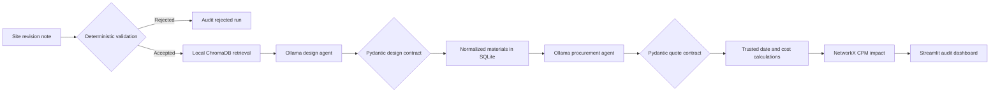

# Construction Multi-Agent System

A private, local proof-of-concept that turns a controlled construction revision note into a traceable design extraction, procurement planning estimate, and Critical Path Method (CPM) impact. The language-model agents run through Ollama; deterministic Python validation and Pydantic contracts prevent invalid notes and malformed model output from entering the audit database.

> This application supports planning demonstrations. It does not replace a licensed engineer, a verified supplier quotation, an approved project programme, or access to the full licensed standards.

## What the system does

1. Rejects irrelevant, ambiguous, contradictory, or incomplete notes before calling the LLM.
2. Retrieves a relevant demonstration reference from a local ChromaDB vector index.
3. Uses a local Ollama design agent to extract a validated revision and one or more material requirements.
4. Uses a local procurement agent to produce clearly labelled **unverified estimates**.
5. Recalculates arithmetic and delivery dates deterministically in Python.
6. Maps the affected element to the correct task in the demonstration CPM network.
7. Stores every completed, rejected, or failed run in SQLite for auditability.



## Requirements

- Windows, macOS, or Linux
- Python 3.12 (the tested version)
- Ollama running locally
- Approximately 6 GB available for the `llama3.1` model

Python 3.12 is supported; installing Python 3.11 is not required for this repository.

## Setup on Windows PowerShell

```powershell
cd "D:\Project Data\Trials\Final XAI\Passant\MultiAgents"
python -m venv .venv
.\.venv\Scripts\Activate.ps1
python -m pip install --upgrade pip
python -m pip install -r requirements.txt
Copy-Item .env.example .env
```

Verify and ingest the controlled RAG source documents:

```powershell
python ingest_documents.py
```

The command verifies each PDF checksum and page count before creating
`rag_data/chunks.jsonl`. Every chunk contains its document edition, jurisdiction,
section or clause when detected, page number, official source URL, licence, and source
checksum. `rag_data/` is generated locally and is intentionally not committed.

Install and prepare Ollama:

```powershell
ollama pull llama3.1
ollama list
```

If the Ollama desktop service is not already running:

```powershell
ollama serve
```

## Run the dashboard

```powershell
python -m streamlit run app.py
```

Open `http://localhost:8501` and use a complete input such as:

```text
Site update Rev-102: Need 150 m3 of C60 concrete for the column pour.
```

The note must contain a revision ID, construction action, supported material, affected element, positive quantity, and unit.

## Run the automated tests

The tests do not call a real language model; Ollama responses are mocked where necessary.

```powershell
python -m unittest discover -s tests -v
python -m unittest test_stress_cases -v
```

The suite verifies input rejection, Pydantic contracts, multiple-material storage, foreign-key enforcement, trusted procurement arithmetic and dates, CPM calculations, ChromaDB retrieval, controlled-PDF integrity, citation metadata, and audit logging.

## Configuration

Copy `.env.example` to `.env`.

| Variable | Default | Purpose |
|---|---|---|
| `CONSTRUCTION_DATABASE_PATH` | `construction_mas.db` | Runtime SQLite path |
| `CONSTRUCTION_OLLAMA_MODEL` | `llama3.1` | Installed Ollama model |
| `CONSTRUCTION_RAG_COLLECTION_NAME` | `construction-standards` | Local vector collection |
| `CONSTRUCTION_RAG_DOCUMENTS_PATH` | `rag_documents` | Controlled PDF sources and manifest |
| `CONSTRUCTION_RAG_DATA_PATH` | `rag_data` | Generated chunks and future persistent index |

## Main files

| File | Responsibility |
|---|---|
| `validation.py` | Rejects unsafe or incomplete inputs before the LLM |
| `schemas.py` | Pydantic contracts and numeric constraints |
| `rag_engine.py` | Offline ChromaDB vector retrieval |
| `ingest_documents.py` | Verified PDF extraction and citation-ready chunk generation |
| `design_agent.py` | Validated design extraction through Ollama |
| `procurement_agent.py` | Unverified procurement estimates with trusted local calculations |
| `cpm_solver.py` | NetworkX schedule and critical-path calculations |
| `agent_pipeline.py` | Orchestration and run-status audit trail |
| `database.py` | SQLite schema, migrations, transactions, and queries |
| `app.py` | Streamlit control centre |

## Data and trust boundaries

- Procurement suppliers and prices are LLM planning estimates and are stored as `PENDING_VERIFICATION` / `LLM_ESTIMATE_UNVERIFIED`.
- Delivery dates and total costs are recalculated in Python instead of being trusted from the model.
- The live retriever still uses a small demonstration library. The controlled PDF ingestion
  stage now produces page-level, source-traceable chunks, but those chunks are not connected
  to the live retriever until the embedding and persistent-index phase is validated.
- The included Approved Document A source applies to England and is not an Egyptian
  compliance authority. Consult the controlled official publication and a licensed engineer
  for engineering decisions.
- The CPM model is a five-task demonstration schedule, not a live Primavera P6 or Microsoft Project integration.
- The workflow is sequentially orchestrated. The agents do not autonomously negotiate or approve construction decisions.

## Deployment

See [DEPLOYMENT.md](DEPLOYMENT.md) for the local demonstration checklist, LAN access, and production-readiness boundary.

## Repository policy

- Runtime `.db` files are intentionally not versioned because they may contain local project records.
- `.env` and Streamlit secrets are never committed.
- `GITHUB_ACTIONS_TESTS.template.yml` contains the ready CI workflow. Copy it to
  `.github/workflows/tests.yml` after the repository token is granted GitHub's
  `workflow` scope.
