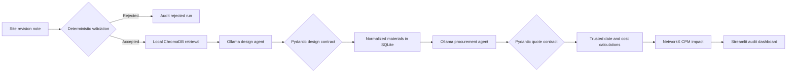

# Construction Multi-Agent System

A private, local proof-of-concept that turns a controlled construction revision note into a traceable design extraction, procurement planning estimate, and Critical Path Method (CPM) impact. The language-model agents run through Ollama; deterministic Python validation and Pydantic contracts prevent invalid notes and malformed model output from entering the audit database.

> This application supports planning demonstrations. It does not replace a licensed engineer, a verified supplier quotation, an approved project programme, or access to the full licensed standards.

## What the system does

1. Rejects irrelevant, ambiguous, contradictory, or incomplete notes before calling the LLM.
2. Routes each question to the relevant controlled discipline and retrieves top-k passages using semantic + BM25-style lexical ranking from persistent local ChromaDB.
3. Uses a local Ollama design agent to extract a validated revision and one or more material requirements.
4. Uses a local procurement agent to produce clearly labelled **unverified estimates**.
5. Recalculates arithmetic and delivery dates deterministically in Python.
6. Maps the affected element to the correct task in the demonstration CPM network.
7. Stores every completed, rejected, or failed run in SQLite for auditability.



## Requirements

- Windows, macOS, or Linux
- Python 3.12 (the tested version)
- Ollama running locally
- Approximately 6 GB available for the `llama3.1` model

Python 3.12 is supported; installing Python 3.11 is not required for this repository.

## Setup on Windows PowerShell

```powershell
cd "D:\Project Data\Trials\Final XAI\Passant\MultiAgents"
python -m venv .venv
.\.venv\Scripts\Activate.ps1
python -m pip install --upgrade pip
python -m pip install -r requirements.txt
Copy-Item .env.example .env
```

Verify and ingest the controlled RAG source documents:

```powershell
python ingest_documents.py
```

The command verifies each PDF checksum and page count before creating
`rag_data/chunks.jsonl`. Every chunk contains its document edition, jurisdiction,
discipline, document status, source-check date, section or clause when detected, printed
and PDF page numbers, official source URL, licence, and source checksum. The controlled
corpus contains official England Approved Documents A (structure), C (ground/moisture),
K (falling/collision/impact), and 7 (materials/workmanship). `rag_data/` is generated
locally and is intentionally not committed.

Build the persistent vector index and run the labelled retrieval evaluation:

```powershell
python index_documents.py
python evaluate_rag.py
```

The first index build uses Chroma's local `all-MiniLM-L6-v2` ONNX embedding model
(384 dimensions) and may download approximately 80 MB into the user's model cache.
No hosted embedding API or API key is required. The index is stored under
`rag_data/chroma` and is reused across application restarts. Re-running
`index_documents.py` is idempotent when the controlled JSONL content has not changed.
The collection contract records both the embedding model identity and its artifact SHA-256;
an incompatible persisted collection is rejected rather than silently mixed.
Retrieval first routes explicit discipline terms to the strongest matching document set,
then combines 75% semantic similarity with 25% normalized lexical relevance. Queries with
no route receive a confidence penalty, while commercial and out-of-jurisdiction intent is
guarded explicitly. The current controlled build contains 586 auditable chunks, of which
526 are retrieval eligible.

Install and prepare Ollama:

```powershell
ollama pull llama3.1
ollama list
```

If the Ollama desktop service is not already running:

```powershell
ollama serve
```

## Run the dashboard

```powershell
python -m streamlit run app.py
```

Open `http://localhost:8501` and use a complete input such as:

```text
Site update Rev-102: Need 150 m3 of C60 concrete for the column pour.
```

The note must contain a revision ID, construction action, supported material, affected element, positive quantity, and unit.

## Run the automated tests

The tests do not call a real language model; Ollama responses are mocked where necessary.

```powershell
python -m unittest discover -s tests -v
python -m unittest test_stress_cases -v
```

The suite verifies input rejection, Pydantic contracts, multiple-material storage, foreign-key enforcement, trusted procurement arithmetic and dates, CPM calculations, persistent ChromaDB retrieval, controlled-PDF integrity, citation metadata, confidence rejection, compatibility safeguards, and audit logging.

## Configuration

Copy `.env.example` to `.env`.

| Variable | Default | Purpose |
|---|---|---|
| `CONSTRUCTION_DATABASE_PATH` | `construction_mas.db` | Runtime SQLite path |
| `CONSTRUCTION_OLLAMA_MODEL` | `llama3.1` | Installed Ollama model |
| `CONSTRUCTION_RAG_COLLECTION_NAME` | `construction-standards` | Local vector collection |
| `CONSTRUCTION_RAG_DOCUMENTS_PATH` | `rag_documents` | Controlled PDF sources and manifest |
| `CONSTRUCTION_RAG_DATA_PATH` | `rag_data` | Generated chunks, index, and evaluation reports |
| `CONSTRUCTION_RAG_CHUNKS_PATH` | `rag_data/chunks.jsonl` | Verified citation-ready ingestion output |
| `CONSTRUCTION_RAG_INDEX_PATH` | `rag_data/chroma` | Persistent local ChromaDB directory |
| `CONSTRUCTION_RAG_TOP_K` | `3` | Maximum cited passages supplied to the design agent |
| `CONSTRUCTION_RAG_MINIMUM_SIMILARITY` | `0.45` | Calibrated hybrid-score acceptance floor |
| `CONSTRUCTION_RAG_SEMANTIC_WEIGHT` | `0.75` | Semantic component of the hybrid retrieval score |
| `CONSTRUCTION_RAG_LEXICAL_WEIGHT` | `0.25` | BM25-style lexical component of the hybrid retrieval score |

## Main files

| File | Responsibility |
|---|---|
| `validation.py` | Rejects unsafe or incomplete inputs before the LLM |
| `schemas.py` | Pydantic contracts and numeric constraints |
| `rag_engine.py` | Discipline routing, hybrid retrieval, persistent ChromaDB, citations, and confidence rejection |
| `ingest_documents.py` | Verified PDF extraction and citation-ready chunk generation |
| `index_documents.py` | Idempotent local MiniLM embedding and persistent indexing |
| `evaluate_rag.py` | Labelled Hit@k, MRR, acceptance, and rejection evaluation |
| `design_agent.py` | Validated design extraction through Ollama |
| `procurement_agent.py` | Unverified procurement estimates with trusted local calculations |
| `cpm_solver.py` | NetworkX schedule and critical-path calculations |
| `agent_pipeline.py` | Orchestration and run-status audit trail |
| `database.py` | SQLite schema, migrations, transactions, and queries |
| `app.py` | Streamlit control centre |

## Data and trust boundaries

- Procurement suppliers and prices are LLM planning estimates and are stored as `PENDING_VERIFICATION` / `LLM_ESTIMATE_UNVERIFIED`.
- Delivery dates and total costs are recalculated in Python instead of being trusted from the model.
- The live retriever uses controlled PDF chunks, local trained MiniLM embeddings,
  BM25-style lexical evidence, discipline routing, persistent ChromaDB storage, top-k
  citations, and a calibrated hybrid confidence threshold.
- The current labelled set has 18 in-scope and 7 out-of-scope questions. The verified
  build reaches 100% Hit@5, Top-1 accuracy, MRR, routing accuracy, positive acceptance,
  and negative rejection on that set. Passing it
  demonstrates this controlled corpus and query set; it is not a general compliance benchmark.
- The included Approved Documents A, C, K and 7 apply to England and are not Egyptian
  compliance authority. Consult the controlled official publication and a licensed engineer
  for engineering decisions.
- The CPM model is a five-task demonstration schedule, not a live Primavera P6 or Microsoft Project integration.
- The workflow is sequentially orchestrated. The agents do not autonomously negotiate or approve construction decisions.

## Deployment

See [DEPLOYMENT.md](DEPLOYMENT.md) for the local demonstration checklist, LAN access, and production-readiness boundary.

## Repository policy

- Runtime `.db` files are intentionally not versioned because they may contain local project records.
- `.env` and Streamlit secrets are never committed.
- `GITHUB_ACTIONS_TESTS.template.yml` contains the ready CI workflow. Copy it to
  `.github/workflows/tests.yml` after the repository token is granted GitHub's
  `workflow` scope.
